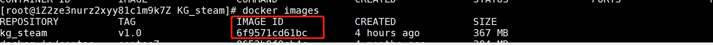

# 2021BigDataFinalWork

**基于neo4j图数据库的Steam热销游戏小型知识图谱**

*访问101.201.145.156:8888可以体验这个简单的kg_demo.*

**部署方式**

1. 下载KG_Steam文件夹到本地
2. 进入到KG_Steam文件夹，执行Dockerfile：`docker build -t kg_steam:V1.0 .`
	* Windows机器修改KG_Steam/app.py，删除host = "0.0.0.0"这个属性。
	* Linux云服务器无需任何修改。
3. `docker run -p 8888:8888 IMAGE_ID` **IMAGE_ID是上一步制作的kg_steam的镜像id.**

4. 访问8888端口就可以了。
